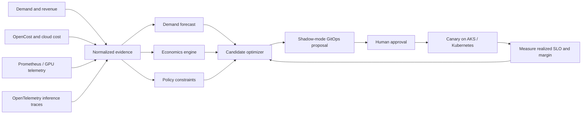

# Kubernetes AI FinOps Autopilot

Evidence-driven **Kubernetes FinOps**, **AI FinOps**, **GPU optimization**, and **AI inference cost optimization** for AKS, NVIDIA NIM, vLLM, Triton, and multi-cloud AI platforms.

This project converts demand, model quality, latency, availability, residency, capacity, infrastructure cost, and revenue-per-outcome evidence into a review-gated GitOps proposal. It optimizes for profitable successful outcomes—not merely cheap tokens.

> Current release: a deterministic, offline decision engine and shadow-mode Helm workload. Live Prometheus, OpenCost, OpenTelemetry, Azure and NVIDIA collectors are roadmap work, not represented as implemented.

The [measured inference comparison](docs/LIVE-INFERENCE-CANARY.md) adds a first operator-supplied benchmark path. It compares two `gifp-bench` reports, declared hourly cost and reviewed quality, then prepares a reversible Gateway API canary proposal if all gates pass. It does not collect cloud billing, route production traffic or verify a customer saving. The included case is fictional and remains on `HOLD`.

## The decision it makes



The included retail workload compares an Azure OpenAI baseline, AKS + NVIDIA NIM, and a low-cost external API. The external API appears cheapest but fails four mandatory policies. The engine selects the admissible profile with stronger projected contribution margin and emits:

- A machine-readable decision and evidence hash
- A human-readable candidate scorecard
- A demand forecast with backtest error
- A shadow-mode Helm values proposal
- A review-only Terraform proposal
- Projected hourly and monthly margin change
- Capacity headroom and controlled-canary instructions

Review the checked-in [reference decision](evidence/retail-inference/decision.md).

## Quick start

Requires Python 3.11+ and no runtime dependencies.

```bash
python3 -m venv .venv
source .venv/bin/activate
python -m pip install -e .
ai-finops examples/retail-inference.json --output generated/retail
```

Or run without installation:

```bash
PYTHONPATH=src python3 -m ai_finops.cli examples/retail-inference.json --output generated/retail
```

Validate everything:

```bash
bash scripts/validate.sh
```

Use the policy gate in a delivery workflow:

```yaml
- uses: AAH20/kubernetes-ai-finops-autopilot@main
  with:
    evidence: examples/retail-inference.json
    output: generated/ai-finops
```

## Implemented capabilities

| Capability | Status |
|---|---|
| Evidence schema validation and fail-closed behavior | Implemented |
| Cost per successful inference and tokens per dollar | Implemented |
| Revenue and contribution margin per hour | Implemented |
| Capacity-constrained throughput | Implemented |
| Latency, quality, availability and residency policy gates | Implemented |
| Dependency-free trend forecasting with backtest MAE | Implemented |
| Candidate selection and baseline comparison | Implemented |
| Evidence receipt and deterministic ordering | Implemented |
| Shadow-mode Helm and Terraform proposals | Implemented |
| Unit tests and CI | Implemented |
| Prometheus, DCGM, OpenCost and OpenTelemetry collectors | Roadmap |
| Live AKS/NIM/vLLM/Triton control | Roadmap |
| Automated canary measurement and rollback | Roadmap |

## Why it is different

Traditional cloud cost tooling asks where spend occurred. This engine asks which admissible infrastructure/model profile maximizes successful business outcomes per dollar. Security and compliance are constraints on optimization, not the product's fear-based headline.

The evidence contract is provider-neutral, so collectors can later normalize:

- Azure OpenAI and Microsoft Foundry
- AKS GPU node pools and NVIDIA NIM
- vLLM and NVIDIA Triton Inference Server
- EKS, GKE and on-premises Kubernetes
- OpenRouter and other API model gateways
- Prometheus, NVIDIA DCGM, OpenCost and OpenTelemetry

## Production safety

The current system never modifies a cluster or cloud resource. Generated proposals default to `shadow` mode, require human approval, and specify a 10% canary. Production automation must add signed evidence, RBAC, policy-as-code, plan/what-if checks, rollback and post-change verification.

See [architecture](docs/ARCHITECTURE.md), [unit economics and KPIs](docs/UNIT-ECONOMICS.md), [production roadmap](docs/ROADMAP.md), and [security policy](SECURITY.md).

## High-value use cases

- AI inference cost optimization and GPU right-sizing
- AKS capacity planning and Kubernetes autoscaling
- Cloud-versus-on-premises inference break-even analysis
- Model routing constrained by SLO, quality and data residency
- Tenant and product gross-margin observability
- FinOps allocation for agentic AI workflows
- Platform-engineering self-service optimization
- MSP-managed AI infrastructure economics

## Commercial deployment

Need a measured AI infrastructure economics assessment, AKS/NVIDIA platform implementation, or managed optimization workflow? [Request an A2Z SOC architecture engagement](https://a2zsoc.com/contact?topic=kubernetes-ai-finops-autopilot&utm_source=github&utm_medium=repository).

MIT licensed. All checked-in prices and workload data are synthetic planning inputs—not vendor quotes or promised savings.
